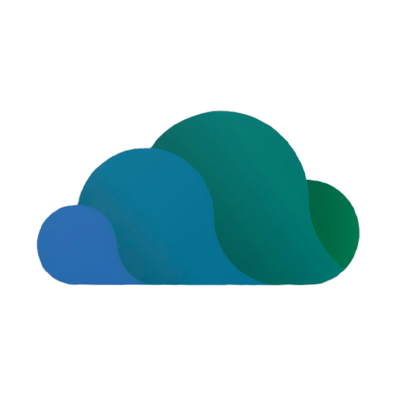
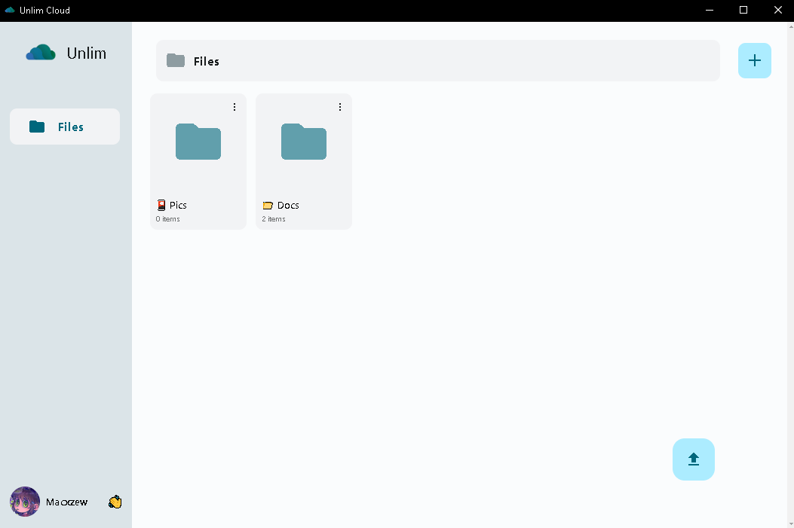

<h1 align="center">Unlim_Desktop </h1>

> 🖥️ Unlim_Desktop est une application desktop cloud basée sur Telegram. 



## 🌐 What is Unlim Cloud?

**Unlim Cloud** is a clever and free cloud storage solution that uses Telegram’s "Saved Messages" to store your files. Once connected, everything you upload is sent to your private Telegram space, letting you access your content from any device, with no storage limits.

The idea was created by **[inulute](https://github.com/inulute)**, who developed both a web app available at [unlim-cloud.web.app](https://unlim-cloud.web.app) and a full Android app on the [Google Play Store](https://play.google.com/store/apps/details?id=com.kratosle.unlim).

**Unlim_Desktop** takes it a step further by offering a clean, native experience for desktop users on Windows and macOS.


## 🚀 Usage

To use this project, follow the steps below in your preferred terminal.

### 1️⃣ Installing Dependencies

Before anything else, install the necessary dependencies:

```shell
npm install
```

Note: This step is mandatory before building or running the application with `npm start`.

### 2️⃣ Build and Run

#### 🔹 Windows

1. Run the following command to build the `Unlim-win32-x64/` folder :

```
npm run build-win
```

2. You can then launch the application by running `Unlim.exe` inside this folder.

#### 🔹 MAC

1. Run the following command to build the `Unlim-darwin-x64/` folder:

```shell
npm run build-mac
```

2. Copy the application to `/Applications/` so that it appears in the Launchpad:

```shell
sudo cp -R Unlim-darwin-x64/Unlim.app /Applications/
```

3. You can then run  `Unlim` directly from the Launchpad.


## 👤 Author

Give a ⭐️ if this project helped you!

## 📝 License

Copyright © 2025 [Macxzew](https://github.com/Macxzew).<br />
This project is [MIT](https://github.com/Macxzew/Unlim_Desktop/blob/main/LICENSE) licensed.
